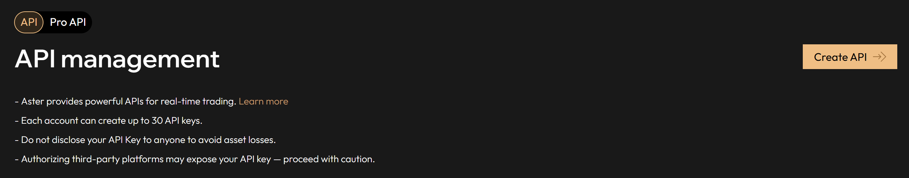
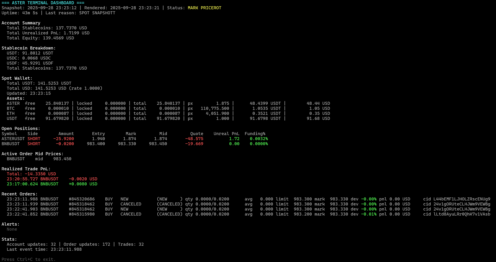

# Aster Finance DEX Market Making strategy with Python

A Python market making bot for the Aster Finance DEX platform using websockets and Rest API calls.

Referral link to support this work: [https://www.asterdex.com/en/referral/164f81](https://www.asterdex.com/en/referral/164f81) .
Earn 10% rebate on fees (I put maximum for you).

**How it works**: The bot performs "ping-pong" trading by placing Open (Long or Short depending on market trend) and Close limit orders around the current market mid-price using a fraction of your available capital in the perpetual futures account. When one order fills (with a significant amount), it immediately places a new order on the opposite side to capture the spread.

**Advanced Features**:
- **Dynamic Spreads**: Avellaneda-Stoikov model for optimal spread calculation
- **Trend Analysis**: SuperTrend indicator for directional bias
- **Real-time Data**: WebSocket-based market data and balance monitoring

## Quick Start

```bash
# Install dependencies
pip install -r requirements.txt

# Run data collector for at least 1 hour
python data_collector.py # Collect real-time market data (check variable `LIST_MARKETS` to add or remove markets)

# run calculation of parameters
python calculate_avellaneda_parameters.py --symbol BNBUSDT --minutes 5  # Calculate dynamic spreads on BNBUSDT based on 5-minutes data chuncks (orders executed, bid-ask spreads)
python find_trend.py --symbol BNBUSDT --interval 5m  # Trend direction determination with SuperTrend based on 5-minutes kline candles

# the above scripts do not need API credentials, but the market_maker.py does need it
# Configure API credentials (create .env file with your credentials)
# See configuration section below for required variables

# Run the market maker on BNBUSDT
python market_maker.py --symbol BNBUSDT

```

Use docker compose to run everything at once (see below).

## Dependencies

The project requires the following Python packages (see `requirements.txt`):

### Core Dependencies
- **aiohttp**: Async HTTP client for API calls
- **websockets & websocket-client**: WebSocket connectivity
- **python-dotenv**: Environment variable management
- **requests**: Synchronous HTTP requests

### Blockchain Integration
- **web3**: Ethereum utilities for signing
- **eth_abi & eth_account**: Ethereum ABI encoding and account management

### Data Analysis & Trading
- **pandas & numpy**: Data manipulation and numerical computing
- **scipy**: Scientific computing for mathematical models
- **arch**: GARCH modeling for volatility estimation (fallback to moving std when it fails)
- **pandas-ta**: Technical analysis indicators

### User Interface
- **colorama**: Terminal color output for better readability

## Configuration

### API Credentials (`.env`)

You need to create both **API** and **Pro API** credentials on Aster Finance as shown below:



```bash
# API V3 (Ethereum-style) - for trading operations (from "Pro API")
API_USER=0x...           # Main account wallet address
API_SIGNER=0x...         # API wallet address
API_PRIVATE_KEY=0x...    # API wallet private key

# API V1 (HMAC-style) - for user data streams (from "API")
APIV1_PUBLIC_KEY=...     # API key for user data streams
APIV1_PRIVATE_KEY=...    # API secret for user data streams

# Trading Configuration
SYMBOL=BNBUSDT          # Trading pair (used by all services), the bot won't work without this one
```


### Main Parameters (`market_maker.py`)
```python
# Strategy Settings
DEFAULT_SYMBOL = "BNBUSDT"              # Default trading pair (overridden by .env SYMBOL)
FLIP_MODE = False                       # True for short-biased, False for long-biased
DEFAULT_BUY_SPREAD = 0.006              # 0.6% below mid-price, fallback if Avellaneda fails
DEFAULT_SELL_SPREAD = 0.006             # 0.6% above mid-price, fallback if Avellaneda fails
USE_AVELLANEDA_SPREADS = True           # Use dynamic spreads from Avellaneda parameters
DEFAULT_BALANCE_FRACTION = 0.2          # Use 20% of balance per order
POSITION_THRESHOLD_USD = 15.0           # Position size threshold in USD

# Timing Settings
ORDER_REFRESH_INTERVAL = 30             # Cancel and replace unfilled orders after 30 seconds
PRICE_REPORT_INTERVAL = 60              # Price reporting frequency
BALANCE_REPORT_INTERVAL = 60            # Balance reporting frequency

# SuperTrend Integration
USE_SUPERTREND_SIGNAL = True            # Use SuperTrend for dynamic flip_mode
SUPERTREND_CHECK_INTERVAL = 600         # Check SuperTrend signal every 10 minutes

# Order Management
DEFAULT_PRICE_CHANGE_THRESHOLD = 0.001  # Min price change to replace order (0.1%)
CANCEL_SPECIFIC_ORDER = True            # Cancel specific orders vs all orders

# Logging
RELEASE_MODE = True                     # True = errors only, False = detailed logs
```

**Important info about Parameters**:
- **`DEFAULT_BALANCE_FRACTION`**: Controls order sizing - with 0.2 (20%), each order uses 20% of your available balance. Lower values = smaller orders, higher values = larger orders but more risk.
- **`POSITION_THRESHOLD_USD`**: When your net position exceeds this USD value ($15 default), the bot will only place orders to reduce the position (no new position building).
- **`LEVERAGE`**: Leverage to use to allow position sizes larger than the account available capital (margin). BE VERY CAREFUL WITH THAT. RECOMMENDED TO ALWAYS LEAVE TO 1.

**Account Recommendation**: Use a **dedicated account** for the bot to avoid conflicts with manual trading and ensure accurate balance calculations.

**Advanced Features**:
- **Dynamic Spreads**: When `USE_AVELLANEDA_SPREADS = True`, the bot automatically calculates optimal spreads using the Avellaneda-Stoikov model
- **SuperTrend Integration**: When `USE_SUPERTREND_SIGNAL = True`, the bot uses trend analysis to determine directional bias
- **Real-time Balance Tracking**: WebSocket-based balance monitoring for accurate position sizing

**Note**: The default ±0.6% spreads work as fallback when dynamic models aren't available. The system now includes:
- Avellaneda-Stoikov model for optimal spread calculation
- SuperTrend analysis for market direction
- Real-time parameter updates every 10 minutes
- Risk management with position thresholds

## Available Scripts

### Core Trading Components
```bash
# Main trading bot
python market_maker.py                  # Start market maker with default symbol
python market_maker.py --symbol BNBUSDT # Start with specific symbol

# Data collection and analysis
python data_collector.py                # Collect real-time market data
python calculate_avellaneda_parameters.py --symbol BNBUSDT  # Calculate dynamic spreads (needs enough data collected)
python find_trend.py --symbol BNBUSDT --interval 5m        # Trend analysis with SuperTrend

# Monitoring and utilities
python terminal_dashboard.py            # Comprehensive account dashboard to check if everything is going well
python get_my_trading_volume.py --symbol BNBUSDT --days 7  # Get your trading volume on BNB for last 7 days
python get_my_trading_volume.py --days 30                  # Get your trading volume across all symbols for last 30 days
```

## Terminal Dashboard

For a comprehensive, real-time overview of your account, use the `terminal_dashboard.py` script. It provides a unified dashboard displaying:
- Account balances (stablecoins and others)
- Open positions with unrealized PnL
- Recent order activity

```bash
python terminal_dashboard.py
```

View of the Dashboard:



## Docker Deployment

The system includes multiple containerized services that work together:

### Services Available
- **data-collector**: Real-time market data collection via WebSocket
- **avellaneda-params**: Dynamic spread calculation using Avellaneda-Stoikov model
- **market-maker**: Main trading bot with market making strategy
- **trend-finder**: SuperTrend analysis for directional bias

### Docker Commands
```bash
# Build all services
docker-compose build

# Run all services
docker-compose up -d

# Run specific service
docker-compose up -d data-collector
docker-compose up -d market-maker

# View logs
docker-compose logs -f market-maker
docker-compose logs -f data-collector

# Stop all services
docker-compose down
```

### Configuration
**Trading pair configuration**: Set `SYMBOL=BNBUSDT` in your `.env` file. All services will automatically use this symbol.

**Service timing**: Configure refresh intervals in `docker-compose.yml`:
```yaml
services:
  data-collector:
    environment:
      - RESTART_MINUTES=2        # Data collection restart interval (if fails)

  avellaneda-params:
    environment:
      - PARAM_REFRESH_MINUTES=10 # Parameter calculation interval

  trend-finder:
    environment:
      - TREND_REFRESH_MINUTES=5  # Trend analysis interval
      - TREND_INTERVAL=5m        # Candlestick timeframe
```

## Performance Recommendations

**Latency is critical** for market making success, specially if you rely on fast order rate (low `ORDER_REFRESH_INTERVAL`). For optimal performance:

- **Recommended**: AWS Tokyo region (ap-northeast-1) with dedicated t3.small instance
- **Why**: Close proximity to Aster Finance servers reduces order placement latency
- **Alternative regions**: Singapore, Hong Kong for Asia-Pacific trading
- Avoid shared/burstable instances during active trading periods

---

**⚠️ Risk Warning**: This trading software will likely lose money, even if it generates significant volume, because it isn’t competitive with professional firms. Always start with small amounts and make sure you understand the risks of automated cryptocurrency trading.

